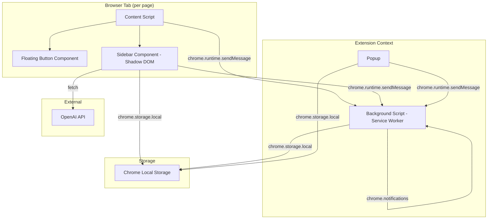
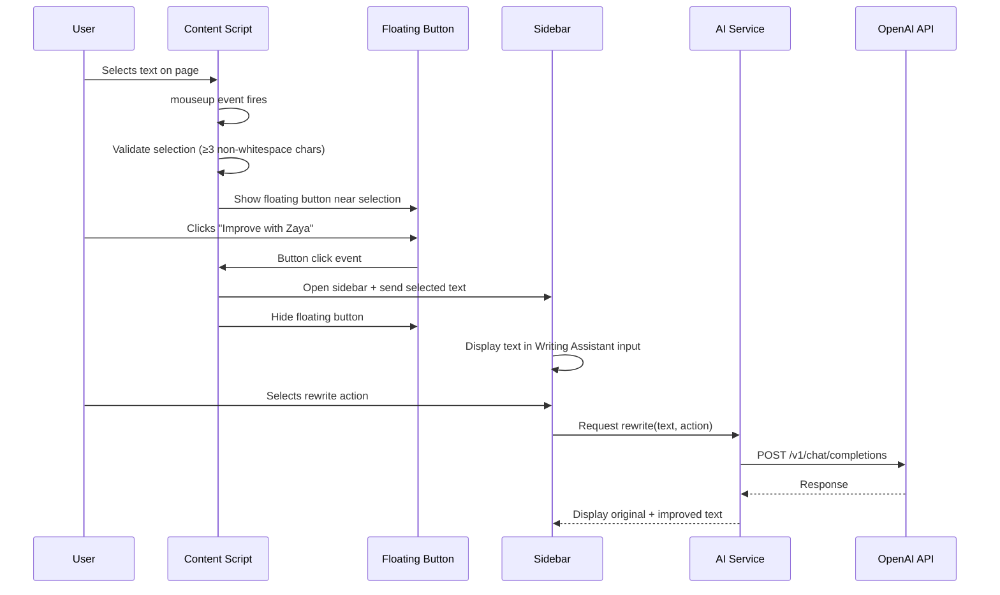

# Design Document: Zaya AI Chrome Extension

## Overview

Zaya is a Chrome Extension (Manifest V3) that provides AI-powered writing assistance, text summarization, task management, and wellness reminders directly within the browser. The extension uses a content-script-injected sidebar architecture rather than Chrome's native Side Panel API, giving full control over styling, animations, and positioning to meet the design requirements.

**Key architectural decisions:**

- **Shadow DOM sidebar**: The sidebar is injected into pages via the content script inside a Shadow DOM to isolate styles from host pages and prevent CSS conflicts. This allows precise control over the 360–400px floating panel with custom animations.
- **Chrome Alarms API for timers**: Since MV3 service workers can terminate after ~30 seconds of inactivity, all wellness reminder scheduling uses `chrome.alarms` instead of `setInterval`/`setTimeout`.
- **Message-passing architecture**: All communication between content script, sidebar, popup, and background script uses `chrome.runtime.sendMessage` and `chrome.runtime.onMessage`.
- **OpenAI Chat Completions API**: Each writing/summarization action maps to a specific system prompt template sent to the Chat Completions endpoint.
- **Local-only storage**: All user data (tasks, preferences, reminder settings) persists exclusively in `chrome.storage.local`.

## Architecture



### Component Communication Flow



## Components and Interfaces

### 1. Content Script (`content.ts`)

**Responsibility**: Detects text selection, manages the floating button lifecycle, injects and communicates with the sidebar.

```typescript
interface SelectionState {
  text: string;
  boundingRect: DOMRect;
  timestamp: number;
}

interface ContentScriptAPI {
  // Selection detection
  onSelectionChange(callback: (state: SelectionState | null) => void): void;
  getSelectedText(): string;

  // Floating button management
  showFloatingButton(position: { top: number; left: number }): void;
  hideFloatingButton(): void;
  repositionFloatingButton(rect: DOMRect): void;

  // Sidebar management
  openSidebar(): void;
  closeSidebar(): void;
  isSidebarOpen(): boolean;
  sendTextToSidebar(text: string): void;
}
```

### 2. Floating Button (`FloatingButton.tsx`)

**Responsibility**: Renders the contextual "Improve with Zaya" button near selected text.

```typescript
interface FloatingButtonProps {
  position: { top: number; left: number };
  onClickAction: () => void;
  visible: boolean;
}
```

### 3. Sidebar (`Sidebar.tsx`)

**Responsibility**: Main UI panel containing all Zaya tools.

```typescript
interface SidebarProps {
  isOpen: boolean;
  onClose: () => void;
  initialText?: string;
}

type SidebarSection =
  | 'writing-assistant'
  | 'summarization'
  | 'output'
  | 'tasks'
  | 'wellness'
  | 'settings';
```

### 4. Writing Assistant (`WritingAssistant.tsx`)

**Responsibility**: Provides rewrite actions and displays results.

```typescript
type RewriteAction =
  | 'proofread'
  | 'make-clearer'
  | 'make-academic'
  | 'make-professional'
  | 'make-shorter'
  | 'make-friendlier'
  | 'simplify'
  | 'fix-grammar';

interface WritingAssistantState {
  inputText: string;
  outputText: string | null;
  selectedAction: RewriteAction | null;
  isLoading: boolean;
  error: string | null;
}
```

### 5. Summarization Tool (`SummarizationTool.tsx`)

**Responsibility**: Provides summarization/simplification actions and displays results.

```typescript
type SummarizationAction =
  | 'summarize'
  | 'explain-simply'
  | 'bullet-points'
  | 'study-notes'
  | 'extract-key-points'
  | 'shorten-article'
  | 'explain-new';

interface SummarizationToolState {
  inputText: string;
  outputText: string | null;
  selectedAction: SummarizationAction | null;
  isLoading: boolean;
  error: string | null;
}
```

### 6. AI Service (`aiService.ts`)

**Responsibility**: Communicates with OpenAI API, manages prompts, handles errors and timeouts.

```typescript
interface AIServiceConfig {
  apiKey: string;
  model: string;          // e.g., "gpt-4o-mini"
  maxTokens: number;
  timeoutMs: number;      // 30000ms
}

interface AIRequest {
  text: string;
  action: RewriteAction | SummarizationAction;
  type: 'rewrite' | 'summarize';
}

interface AIResponse {
  success: boolean;
  result?: string;
  error?: string;
}

interface AIServiceAPI {
  rewrite(text: string, action: RewriteAction): Promise<AIResponse>;
  summarize(text: string, action: SummarizationAction): Promise<AIResponse>;
}
```

### 7. Task Organizer (`TaskOrganizer.tsx`)

**Responsibility**: Minimal task list with local persistence.

```typescript
interface Task {
  id: string;
  text: string;
  completed: boolean;
  createdAt: number;    // Unix timestamp
}

interface TaskOrganizerAPI {
  addTask(text: string): Task | null;
  toggleTask(id: string): void;
  deleteTask(id: string): void;
  getTasks(): Task[];
}
```

### 8. Background Script (`background.ts`)

**Responsibility**: Service worker managing wellness reminder alarms and notifications.

```typescript
interface ReminderConfig {
  type: 'water' | 'stretch' | 'break';
  enabled: boolean;
  intervalMinutes: 30 | 60 | 90;
}

interface BackgroundAPI {
  // Reminder management
  setReminder(config: ReminderConfig): void;
  cancelReminder(type: ReminderConfig['type']): void;
  getReminderStatus(): Promise<ReminderConfig[]>;

  // Alarm handlers
  onAlarmFired(alarm: chrome.alarms.Alarm): void;

  // Lifecycle
  onInstalled(): void;
  onStartup(): void;
}
```

### 9. Popup (`Popup.tsx`)

**Responsibility**: Minimal toolbar popup with Open Zaya button and reminder toggle.

```typescript
interface PopupState {
  remindersEnabled: boolean;
  isLoading: boolean;
}
```

### 10. Storage Service (`storageService.ts`)

**Responsibility**: Abstraction over `chrome.storage.local` for typed access.

```typescript
interface StorageSchema {
  tasks: Task[];
  preferences: UserPreferences;
  reminders: ReminderConfig[];
  apiKey: string;
}

interface StorageServiceAPI {
  get<K extends keyof StorageSchema>(key: K): Promise<StorageSchema[K] | null>;
  set<K extends keyof StorageSchema>(key: K, value: StorageSchema[K]): Promise<void>;
  remove(key: keyof StorageSchema): Promise<void>;
  onChanged(callback: (changes: Partial<StorageSchema>) => void): void;
}
```

## Data Models

### Task

| Field       | Type      | Description                          |
|-------------|-----------|--------------------------------------|
| id          | string    | UUID v4 identifier                   |
| text        | string    | Task description (1–200 chars)       |
| completed   | boolean   | Whether the task is marked done      |
| createdAt   | number    | Unix timestamp of creation           |

### UserPreferences

| Field              | Type            | Description                              |
|--------------------|-----------------|------------------------------------------|
| reminders          | ReminderConfig[]| Array of 3 reminder configurations       |
| apiKey             | string          | OpenAI API key (stored locally)          |

### ReminderConfig

| Field           | Type                    | Description                        |
|-----------------|-------------------------|------------------------------------|
| type            | 'water' \| 'stretch' \| 'break' | Reminder category         |
| enabled         | boolean                 | Whether this reminder is active    |
| intervalMinutes | 30 \| 60 \| 90         | Interval between notifications     |

### AI Prompt Templates

Each action maps to a system prompt:

| Action            | System Prompt Pattern                                                    |
|-------------------|--------------------------------------------------------------------------|
| proofread         | "Proofread the following text. Fix errors. Preserve meaning."            |
| make-clearer      | "Rewrite to be clearer and easier to understand. Preserve meaning."      |
| make-academic     | "Rewrite in academic tone. Preserve meaning."                            |
| make-professional | "Rewrite in professional tone. Preserve meaning."                        |
| make-shorter      | "Make this text shorter while preserving key meaning."                   |
| make-friendlier   | "Rewrite in a warm, friendly tone. Preserve meaning."                   |
| simplify          | "Simplify this text for easy reading. Preserve meaning."                 |
| fix-grammar       | "Fix all grammar issues. Preserve meaning and tone."                     |
| summarize         | "Summarize the following text concisely."                                |
| explain-simply    | "Explain this text in simple terms anyone can understand."               |
| bullet-points     | "Convert this text into clear bullet points."                            |
| study-notes       | "Create study notes from this text with key concepts highlighted."       |
| extract-key-points| "Extract the key points from this text as a list."                       |
| shorten-article   | "Shorten this article while preserving the main ideas."                  |
| explain-new       | "Explain this as if the reader is completely new to the topic."          |

### Chrome Storage Structure

```json
{
  "tasks": [
    { "id": "uuid", "text": "...", "completed": false, "createdAt": 1700000000 }
  ],
  "preferences": {
    "reminders": [
      { "type": "water", "enabled": true, "intervalMinutes": 60 },
      { "type": "stretch", "enabled": true, "intervalMinutes": 60 },
      { "type": "break", "enabled": true, "intervalMinutes": 60 }
    ],
    "apiKey": "sk-..."
  }
}
```

### Manifest.json Structure

```json
{
  "manifest_version": 3,
  "name": "Zaya",
  "version": "1.0.0",
  "description": "AI browser companion for writing, summarization, and wellness",
  "permissions": ["storage", "alarms", "notifications", "activeTab", "scripting"],
  "background": {
    "service_worker": "background.js"
  },
  "action": {
    "default_popup": "popup.html",
    "default_icon": { "16": "icons/icon16.png", "48": "icons/icon48.png", "128": "icons/icon128.png" }
  },
  "content_scripts": [
    {
      "matches": ["<all_urls>"],
      "js": ["content.js"],
      "css": [],
      "run_at": "document_idle"
    }
  ],
  "icons": {
    "16": "icons/icon16.png",
    "48": "icons/icon48.png",
    "128": "icons/icon128.png"
  }
}
```

## Correctness Properties

*A property is a characteristic or behavior that should hold true across all valid executions of a system — essentially, a formal statement about what the system should do. Properties serve as the bridge between human-readable specifications and machine-verifiable correctness guarantees.*

### Property 1: Floating Button Positioning Stays Within Viewport

*For any* selection bounding rectangle and any viewport dimensions, the computed floating button position SHALL be within 8px of the selection bounding box edge, SHALL NOT overlap the selected text area, and SHALL be fully contained within the visible viewport boundaries.

**Validates: Requirements 1.2**

### Property 2: Text Selection Minimum Length Validation

*For any* string, the selection validation function SHALL return true (show button) if and only if the string contains 3 or more non-whitespace characters, and SHALL return false otherwise.

**Validates: Requirements 1.5**

### Property 3: Writing Assistant Input Length Validation

*For any* string, the writing assistant validation function SHALL accept the string for AI processing if and only if its length is between 1 and 5000 characters (inclusive), and SHALL reject empty strings and strings exceeding 5000 characters without sending an API request.

**Validates: Requirements 3.9**

### Property 4: Summarization Input Length Validation

*For any* string, the summarization validation function SHALL accept the string for processing if and only if it contains 20 or more characters, and SHALL reject strings with fewer than 20 characters without sending an API request.

**Validates: Requirements 4.6**

### Property 5: AI Request Construction Correctness and Privacy

*For any* valid text and any action (rewrite or summarization), the constructed API request SHALL contain exactly the provided text and the system prompt corresponding to the chosen action, SHALL NOT include any data beyond the text and action-related fields (no browsing history, page URLs, or user metadata), and the text SHALL be truncated to 5000 characters for rewrite actions or 10000 characters for summarization actions.

**Validates: Requirements 3.2, 4.2, 11.3**

### Property 6: Wellness Notification Message Selection

*For any* reminder type (water, stretch, or break), when the alarm fires, the notification message SHALL be selected from the predefined message list for that specific reminder type and SHALL never contain a message from a different type's list.

**Validates: Requirements 8.3**

### Property 7: Task Input Validation

*For any* string, the task creation function SHALL accept the string if and only if it contains at least one non-whitespace character and its total length does not exceed 200 characters. Strings that are empty, whitespace-only, or exceed 200 characters SHALL be rejected without creating a task.

**Validates: Requirements 9.1, 9.2**

### Property 8: Task Persistence Round-Trip

*For any* list of valid tasks (up to 100), saving the task list to Chrome local storage and then reading it back SHALL produce a list that is deeply equal to the original list, preserving all task fields (id, text, completed, createdAt).

**Validates: Requirements 9.5**

### Property 9: Task Display Sort Order

*For any* list of tasks with mixed completion states and creation timestamps, the sort function SHALL produce an ordering where all incomplete tasks appear before all completed tasks, and within each group tasks are ordered by createdAt descending (newest first).

**Validates: Requirements 9.7**

### Property 10: Preferences Persistence Round-Trip with Defaults

*For any* set of user preferences, saving them to Chrome local storage and reading them back SHALL produce equivalent preferences. When no preferences exist in storage, loading SHALL return the default values (all reminders enabled, 60-minute intervals). Partial preferences SHALL be merged with defaults for any missing fields.

**Validates: Requirements 10.4, 10.5**

## Error Handling

### AI Service Errors

| Error Condition | User-Facing Message | Behavior |
|----------------|---------------------|----------|
| OpenAI API returns 4xx/5xx | "Something went wrong. Please try again in a moment." | Remove loading indicator, show error in output area |
| Request timeout (30s) | "The request took too long. Please try again." | Abort fetch, remove loading indicator, show error |
| Network offline | "You appear to be offline. Check your connection and try again." | Don't send request, show error immediately |
| Invalid API key | "Your API key doesn't seem to be working. Check your settings." | Show error, link to settings |
| Rate limited (429) | "Too many requests. Please wait a moment and try again." | Show error with retry suggestion |

### Content Script Errors

| Error Condition | Behavior |
|----------------|----------|
| Message passing failure | Show non-blocking toast notification for 4 seconds |
| Shadow DOM injection fails | Log error, extension degrades gracefully (no sidebar on that page) |
| Selection API unavailable | Silently skip — no floating button on incompatible pages |

### Storage Errors

| Error Condition | Behavior |
|----------------|----------|
| `chrome.storage.local` write fails | Display inline error "Preferences could not be saved", retain in-session state |
| Storage quota exceeded (tasks) | Display message "Task limit reached (100 tasks). Delete some tasks to add more." |
| Corrupted storage data | Reset to defaults, log warning |

### Clipboard Errors

| Error Condition | Behavior |
|----------------|----------|
| `navigator.clipboard.writeText` fails | Show error "Copy failed. Try selecting and copying manually." for 5 seconds |
| Clipboard permission denied | Same as above |

### Notification Permission

| Error Condition | Behavior |
|----------------|----------|
| `Notification.permission === 'denied'` | Show in-extension message: "Enable notifications in browser settings to receive reminders." Do not schedule alarms. |
| Permission not yet requested | Prompt for permission when user first enables a reminder |

## Testing Strategy

### Unit Tests (Vitest + React Testing Library)

Unit tests cover specific examples, edge cases, and component rendering:

- **Component rendering**: Verify each React component renders correctly with various props
- **UI interactions**: Button clicks, toggle switches, input field behavior
- **Error states**: Verify error messages display correctly for each error condition
- **Edge cases**: Empty states, boundary values, permission denied scenarios
- **Integration points**: Message passing mocks, storage API mocks

### Property-Based Tests (fast-check + Vitest)

Property-based tests verify universal correctness properties across randomized inputs. Each property test runs a minimum of 100 iterations.

**Library**: [fast-check](https://github.com/dubzzz/fast-check) — the standard PBT library for TypeScript/JavaScript.

**Configuration**:
- Minimum 100 iterations per property (`numRuns: 100`)
- Each test tagged with: `Feature: zaya-ai-chrome-extension, Property {number}: {title}`

**Properties to implement**:

1. **Positioning algorithm** — Generate random DOMRect values and viewport sizes, verify constraints
2. **Selection validation** — Generate arbitrary strings, verify 3+ non-whitespace char rule
3. **Writing input validation** — Generate strings of varying length, verify 1–5000 char acceptance
4. **Summarization input validation** — Generate strings, verify ≥20 char acceptance
5. **AI request construction** — Generate text + action pairs, verify payload correctness
6. **Notification message selection** — Generate reminder types, verify message from correct list
7. **Task input validation** — Generate strings, verify acceptance/rejection rules
8. **Task persistence round-trip** — Generate task arrays, verify save/load equality
9. **Task sort order** — Generate task arrays with mixed states, verify sort invariant
10. **Preferences round-trip** — Generate preference objects, verify save/load with defaults

### Integration Tests

- **Chrome API mocking**: Test message passing flows between content script, sidebar, and background
- **Service worker lifecycle**: Test alarm re-registration on service worker restart
- **End-to-end flows**: Text selection → floating button → sidebar → AI response → copy

### Manual/Smoke Tests

- Extension loads without manifest errors in developer mode
- Content script injects on various page types (HTML, Google Docs, Canvas LMS)
- Notifications fire at correct intervals
- Extension uninstall clears all storage
